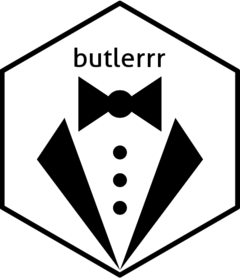

<!-- README.md is generated from README.Rmd. Please edit that file -->

```{r, include = FALSE}
knitr::opts_chunk$set(
  collapse = TRUE,
  comment = "#>",
  fig.path = "man/figures/README-",
  out.width = "100%"
)
```

# butlerrr <a href="https://f-dallolio.github.io/butlerrr/"></a>

<!-- badges: start -->

<!-- badges: end -->

The goal of `butlerrr` is to provide helper and convenience (hence the name) functions for some recurring R coding operations.

## Installation

You can install the development version of butlerrr from [GitHub](https://github.com/) with:

``` r
# install.packages("devtools")
devtools::install_github("f-dallolio/butlerrr")
```

## Why `butlerrr`?

`Butlerrr` provides helper and convenience functions to help with the coding and manipulation of different kinds of R objects. 

Some of the most important functions in `butlerrr` deal with symbolic objects and calls. 

Specifically, `symc` (alias for `as_symbolic_obj`) and `encall`, as well as their vectorized equivalents `symcs` (`as_symbolic_objs`) and `encalls`, convert arbitrary R objects in symbolic objects (symbols or calls) and calls.

### Symbolic objects

Some exaples for symbolic objects with `symc` (or `as_symbolic_obj`)...

```{r}
library(butlerrr)
symc("mean") # string representation of a symbol returns a symbol
symc("mean()") # string representation of a call returns a call
symc(mean) # a function returns the call including the function namespace.
```

...and the vectorized version `symcs` (or `as_symbolic_objs`).

```{r}
x <- list("sd", 1)
symcs("mean", "mean()", mean)
```

`symcs` (and `as_symbolic_objs`) also includes an argument called `.x` for vector inputs that gets appended to the elements of `...` and arguments for naming. For example, `.named` that if `TRUE` automatically names the unnamed elements of the resulting list.

``` {r}
symcs("mean", b = "mean()", mean, .x = x, .named = TRUE)
```

### Calls

`encall` and `encalls` do the same but convert objects to "named" calls (e.g. in the form `func(args)`).

```{r}
encall("mean")
encall("mean()")
encall(mean)
x <- list("sd", 1)
encalls("mean", "mean()", mean)
encalls("mean", b = "mean()", mean, .x = x, .named = TRUE)
```
